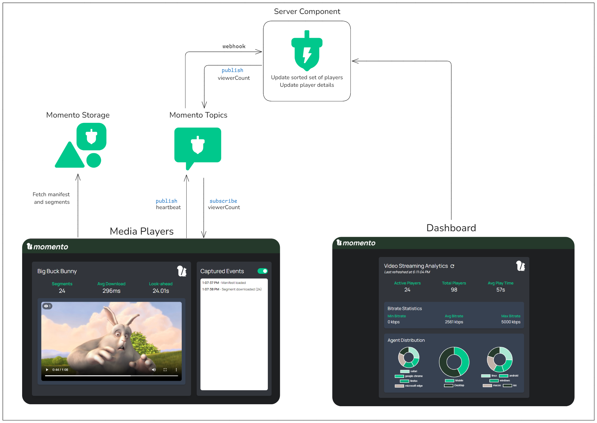

# Momento Video Streaming

This demo showcases how Momento elevates media streaming through all the services in its platform. By using Momento Storage, Topics, and Cache, an immersive media experience is created that not only provides a zero buffer rate (ZBR), but also allows for real-time analytics and insights. To view the live demo, you can visit one of the links below.

* [Media player](https://labs.gomomento.com/video)
* [Dashboard analytics](https://labs.gomomento.com/video/dashboard)

## Architecture



[Momento Storage](https://www.gomomento.com/platform/storage/) is used as the media origin. It persists the HLS manifest file along with the segments of the playable media. The browser uses an
[HLS video streaming library](https://www.npmjs.com/package/hls.js) to stream content directly from Momento Storage.

While users are active on the page, a heartbeat is sent to the server component via [Momento Topics](https://www.gomomento.com/platform/topics/). The heartbeat contains meta information about the device streaming the data along with data about the player itself. An example heartbeat is below:

```json
{
  "playerId": "myPlayerId",
  "bitrate": 5000,
  "playTime": 21,
  "agent": {
    "os": "macOS",
    "browser": "Google Chrome",
    "device": "Desktop"
  }
}
```

These heartbeats are delivered to the server component (an AWS Lambda function) by Momento Topics [via a webhook](https://docs.momentohq.com/topics/webhooks/overview). The server takes the information from the heartbeat and performs three actions:

1. Updates a Momento Cache [sorted set](https://docs.momentohq.com/cache/develop/basics/datatypes#dictionaries) with the `playerId` and the current time
2. Overwrites a Momento Cache [dictionary](https://docs.momentohq.com/cache/develop/basics/datatypes#dictionaries) item specific to the playerId with the heartbeat data
3. Counts all the players from the sorted set that have [sent a heartbeat in the past 1.5 seconds](https://docs.momentohq.com/cache/develop/api-reference/sorted-set-collections#sortedsetfetchbyscore) and publishes to the *viewerCount* topic

The media player page subscribes to the *viewerCount* topic and when the message is recieved, updates the active viewers count seen in the top left corner of the video player.

## Analytics

When a user loads the dashboard, the aggregated data from all the media players is pulled from Momento Cache and used to calculate real-time metrics on the streaming media. Metrics calculated from the heartbeats include:

* Total number of viewers
* Active number of viewers
* Average play time
* Minimum bitrate streamed by any player
* Maximum bitrate streamed by any player
* Average bitrate streamed across all players
* Distribution of viewers by
*  * Device type
*  * Operating system
*  * Browser

All these metrics are calculated on demand and give you a glimpse of the stream *at that given point in time*.

## Deployment

If you'd like to try this yourself, the entire solution is contained in this repository and is deployable via an AWS SAM template.

### Pre-requisites

* [AWS SAM CLI](https://docs.aws.amazon.com/serverless-application-model/latest/developerguide/install-sam-cli.html#install-sam-cli-instructions)
* [AWS CLI](https://docs.aws.amazon.com/cli/latest/userguide/getting-started-install.html)
* [Node.js 20](https://nodejs.org/en/blog/release/v20.9.0)
* An AWS account and a profile configured on your machine via the AWS CLI
* A [Momento API key](https://console.gomomento.com/api-keys)

### Commands

To deploy the template to your AWS account, you can run the following commands:

```bash
sam build
sam deploy --guided --profile <OPTIONAL PROFILE NAME>
```

This will guide you through a deployment wizard that will ask you for your Momento API key. Upon successful deployment, the app will be operational and can be found at the `VideoBaseUrl` output.
